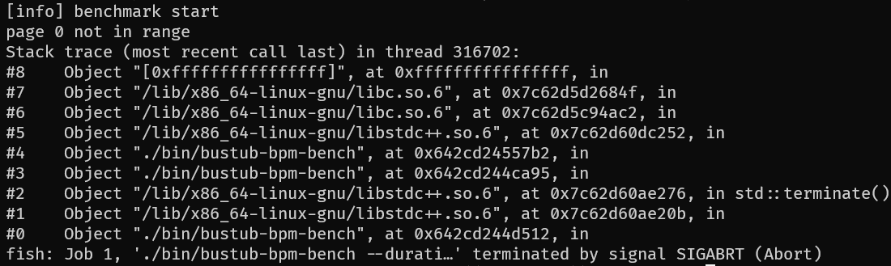

# Task#1 Buffer Pool

## 奇怪的 Page 0 not in range
### 现象
运行 bustub-bpm-bench 做性能测试时，如果是Debug版本，就能正常运行，如果是Release版本，就会crash：

### 分析过程
因为不能使用 Debug 版本，只能阅读源码+打印日志来定位错误了。
- 在 bpm_bench.cc 中每次 NewPage 后打印 disk_manager 中 data_ 的长度。——理论上在第65次应当打印1，结果还是0，说明这个NewPage没有成功将超出缓冲区的页面写入磁盘。
- 在 NewPage() 中的 GetFrame() 函数的开始和结束都打印日志。——第65次是能够成功获取到最开始的 frameid 0 的，好像没什么问题
- 在 GetFrame() 中的 FlushPage() 函数的开始和结束也都打印日志。——没有显示这个日志。为什么没有经过这句话呢？难道是if条件没符合？
- 我把包裹 FlushPage() 的if条件去掉，无论如何都执行。——还是没有日志，但是Debug模式下有。这时我才反应过来，我为了及时获取错误信息，把 FlushPage() 函数的调用放在了 assert 里，现在换成 Release 模式后它就不执行了。

### 解决方法
将FlushPage()函数从assert里拎出来！
```diff
-    assert(FlushPageL(page->GetPageId()));
+    auto res = FlushPageL(page->GetPageId());
+    assert(res);
```
