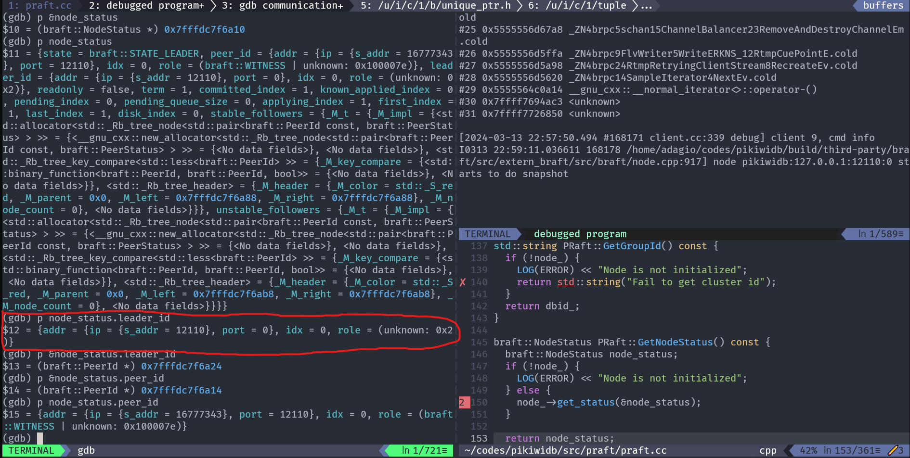
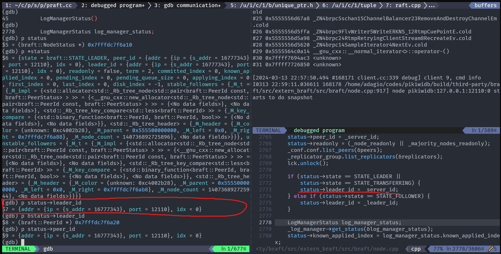
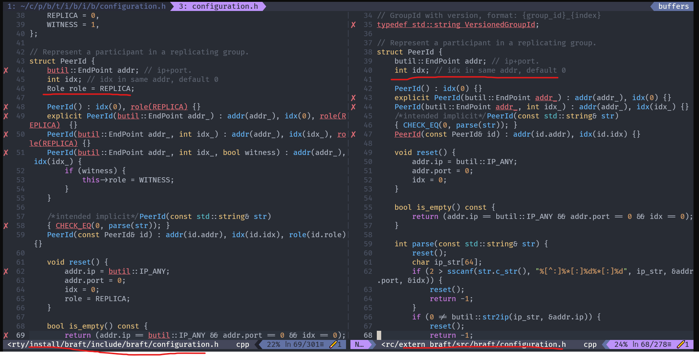
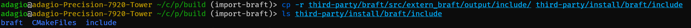

# 基于 braft 实现 PikiwiDB 的 Raft 集群

## 消失的Role
### 现象
对 leader init 后发送 info raft 命令会导致崩溃或不正确的leader_id。

debug 进去发现问题出现在获取 `NodeStatus` 时，也就是在 praft.cc  PRaft::GetNodeStatus() 函数中，这个函数会调用braft node 的接口来获取 NodeStatus，但是获取的leader_id是很奇怪的：

leader_id 应该是的 ip 是 port，port变成了 0，这肯定不对。

### 探索
为进一步发掘原因，进入braft debug。PRaft::GetNodeStatus() 函数如下，然后再进入到 node_->get_status(&node_status) 中，这里就是braft中的代码了。display status->leeder_id，当然一开始都是初始值0。直到为leader_id变量赋值，赋值后打印变量：

能看出来 leader_id 是正确的，ip、port都没问题，没有上述图片中的问题，甚至之后每一行都没问题。

但是一旦从这个函数返回，在 PRaft::GetNodeStatus() 中时，debug 打印出的信息就又变成了第一幅图片中的内容。

### 分析
仔细对比还是能发现一下不同的：
- pikiwidb 中的 leader_id 比 braft 中的 leader_id 多了个变量 role
- pikiwidb 中 leader_id 地址也跟 braft 中的不一样。
  
这个时候我猜测大概率是因为这个 role 导致的，但是还不知道原因，只是单纯的懵逼，为什么一个结构体，在braft里边就没 role，在braft 外边就有role？

- 是不是编译链接的问题？
- 是不是 praft.cc 编译的是之前的，braft.cc 是新的？或者反过来的？总之就是两者不匹配？
这时突然想到了更可靠的可能性：
- praft.cc 引入的头文件和 braft 对应源文件引入的头文件是不是不一样？有可能一个是include本地版本，另一个include 拉取的最新版本？

但是我本地没有 braft 啊，或许是拉取braft时，编译安装除了问题？于是我去对比了我能找得到的两份braft头文件：`./build/third-party/install/braft/include/braft/configuration.h` 和 `./build/third-party/braft/src/extern_braft/src/braft/configuration.h`：


确实不一样。install 函数中是带role的，braft 源码中是不带role的，praft.cc include 的是前者，因此，从braft出来后多的role成员变量造成了内存偏移。具体而言，node_status中peer_id与leader_id是一样类型，都多了role这个成员变量，4字节。而peer_id在leader_id，除去多出的这个变量外看上去很正常。但是因为多了 role，导致node_status结构体中peer_id后续的变量都整体向后移了4字节，因此 leader_id 就变得奇怪了，IP 就等于 port 了。

这个 role 是 braft master 分支才有的，之前用的1.1.2版本是没有的，因此冲突点在于我之前为了解决__const__编译失败问题时，将 braft 从 1.1.2 版本改用master分支

因此解决思路就是保证braft和praft.cc引入的头文件一定要一致！

这个时候我去看了 braft.cmake 是如何编译安装的：
```CMake
ExternalProject_Add(
  extern_braft
  ...
  BUILD_COMMAND $(MAKE) -j ${CPU_CORE} braft-static
  INSTALL_COMMAND mkdir -p ${BRAFT_INSTALL_DIR}/lib/ COMMAND cp ${BRAFT_SOURCES_DIR}/src/extern_braft/output/lib/libbraft.a ${BRAFT_LIBRARIES} COMMAND cp -r ${BRAFT_SOURCES_DIR}/src/extern_braft/output/include ${BRAFT_INCLUDE_DIR}/
)
```

主要是最后一行，用 cp 安装很奇怪，但又看不出来毛病。

直到我尝试自己用cp命令复制一下试一试：


cp 复制目录时，若目标目录不存在则创建与源目录相同的目录名；若存在且非空，则在该目录下创建与源目录相同的目录名。

所以，图中include 目录下多了一个include。

### 解决
原因找到了，就好解决了。暂时使用一个笨点的方法，是 clear.sh
