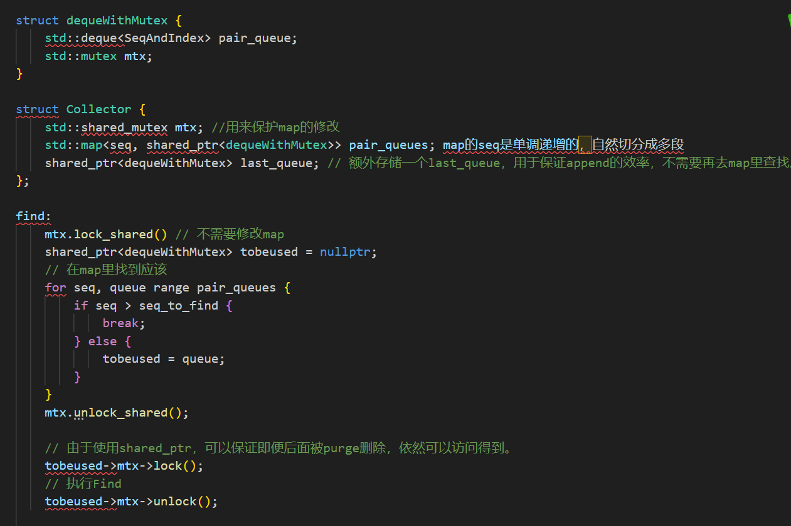
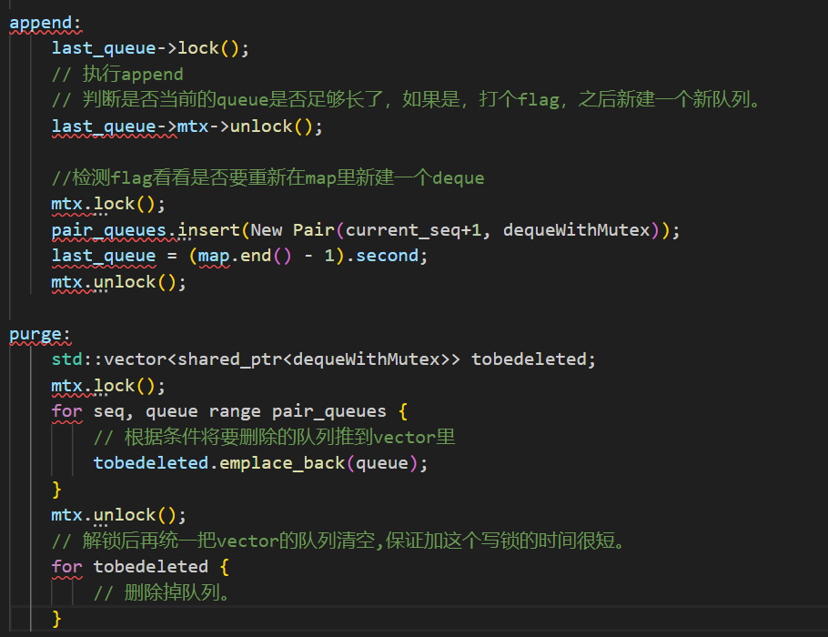

# 多队列避免争抢锁的 LogIndexAndSequenceCollector 优化方案

## 概述
`LogIndexAndSequenceCollector` 主要是维护一个保存 braft log index （后简称logidx）和 rocksdb sequence number （后简称seqno）映射关系的队列，作用在于可以通过 seqno 找到对应的 logidx。为此提供了 3 个 API：
- `LogIndex FindAppliedLogIndex(SequenceNumber seqno)`：
  - 作用：在队列中找到不大于 seqno 的最大 seqno 所对应的映射，返回该映射中的 logidx。是只读的。
  - 调用场景：在每次 flush 时要在 SST 中写入该次 flush 中最大的 logidx，我们可以获取到该次 flush 中最大的 seqno，通过这个 seqno 调用该 API 找到不超过该 seqno 的最新的 logidx。
- `void Update(LogIndex logidx, SequenceNumber seqno)`：
  - 作用：添加新的 logidx-seqno 映射对到队列尾部。
  - 调用场景：在每次成功 apply 一个日志后，将该日志的 index 和该日志中第一个操作对应的 seqno 添加到队列中。
- `void Purge(LogIndex smallest_flushed_logidx)`：
  - 作用：清理已经 flushed 的映射对，但是要保证队列中至少有一个映射对的 logidx 是小于 smallest_flushed_logidx
  - 调用场景：每次 flush 完毕后可以清理队列，保证队列长度不会过长。

由于是并发场景下，三个API都应该加🔒。

其中，`Find` 是在每次 flush 时调用（compaction时直接返回0，不需要争抢🔒），flush 本身也算瓶颈点，如果 find 花费时间较长（除去🔒的影响，当前采用的是二分查找，时间复杂度O(logn)），或者🔒的争抢比较激励，对 flush 还是有一定影响。

`Update` 是在每次 apply 日志时调用，braft 的 apply 是串行化操作，这里的操作是O(1)，但如果这里🔒争抢比较激烈，对性能也会有一定程度的影响。

优化方向有两个：一是避免🔒的争抢，二是尽可能缩短 find 查询时间。但主要瓶颈应该在🔒的争抢上。

因此，望哥提出了通过多队列来避免争抢🔒的优化思路。

## 方案思路
Collector 中维护多个队列（后称小队列），同时保存多个队列的数据结构也是个队列（称大队列）。Collector 有一个整体的🔒，用于保护保存大队列；每个队列也有一个自己的🔒，用于保护小队列队列中元素的读写。

这样的好处是，`Update` 只需要关注最后一个小队列，如果它不满，就直接上小队列的🔒-添加-解🔒-返回，一气呵成；如果满了，就创建一个包含要添加元素的新小队列，再把新小队列添加进大队列，这样就只需要在添加到大队列时上大🔒即可。

`Find` 需要首先上大队列的读🔒找到对应的小队列，得到对应的小队列后就可以解锁大🔒，然后上小队列的🔒进行查找。

`Purge` 就上大🔒删掉需要删除的队列。但这里有个进一步优化点在于，用 `shared_ptr` 保存小队列，在删除时提前拷贝智能指针到容器里，只在大队列里做结构上的删除，这个小队列的生命周期还不不结束。当大队列遍历完了、解🔒之后，再结束掉需要删除的小队列的生命周期，这样可以把小队列的析构时间放在大🔒之外，也不影响其他API。

## 伪代码

